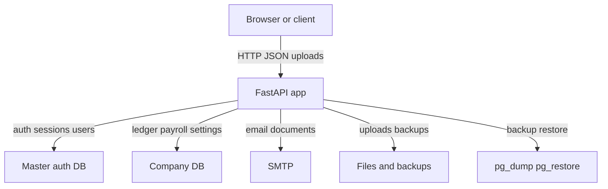

## Executive summary
- SlowBooks-Pro-2026 has a strong permission model on most business CRUD routes, but the repo currently exposes a critical gap: multiple financial reporting and customer-statement endpoints are reachable without authentication while the app also accepts raw `X-Company-Database` selection and enables wildcard CORS. In practice, that makes unauthenticated financial data exposure, cross-company data access, browser-driven localhost exfiltration, and SMTP-backed statement abuse the top risks. Secondary risks are open first-user bootstrap, plaintext secret storage, and resource-exhaustion exposure across import/PDF surfaces.

## Scope and assumptions
- **In scope:** `app/`, runtime-facing `scripts/bootstrap_database.py`, `docker-compose.yml`, `Dockerfile`, `.env.example`, `README.md`, and `INSTALL.md`.
- **Out of scope:** test-only fixtures/assertions except where they clarify intended behavior; retrospective docs under `docs/` except for deployment assumptions.
- **Assumptions:**
  - The primary runtime is the FastAPI app in `app/main.py`, with the SPA in `index.html` and `app/static/js/*.js`.
  - The intended baseline deployment is local or self-hosted small-business use, based on `README.md` / `INSTALL.md` and `docker-compose.yml` exposing the app on `http://localhost:3001`.
  - Company-scoped accounting data lives in databases chosen via `X-Company-Database` (`app/database.py`), while auth/session state is intended to live in the master DB (`app/services/auth.py`).
  - Payroll data is sensitive PII/financial data and materially raises impact (`app/models/payroll.py`, `app/routes/payroll.py`, `app/routes/employees.py`).
  - SMTP may be configured in production and is used for document delivery (`app/routes/settings.py`, `app/services/email_service.py`).
- **Open questions that would materially change risk ranking:**
  - Is the app ever exposed beyond loopback or a VPN/reverse proxy?
  - Is multi-company enabled in production, and are multiple real company DBs reachable from one app instance?
  - Are SMTP credentials dedicated to this app or shared with broader corporate mail infrastructure?

## System model
### Primary components
- **Browser SPA** — `index.html` plus `app/static/js/*.js`; stores bearer tokens and selected company DB in `localStorage` (`app/static/js/api.js`, `app/static/js/app.js`).
- **FastAPI application** — mounts all API routers and static files; enables global CORS in `app/main.py`.
- **Master auth/company database** — used by `get_master_db()` and auth/session logic in `app/services/auth.py`.
- **Company-specific accounting databases** — selected by the `X-Company-Database` header via `app/database.py:get_db`.
- **Filesystem-backed artifacts** — uploads under `app/static/uploads`, backups under repo-local `backups/`.
- **External services/tools** — SMTP delivery (`app/services/email_service.py`) and PostgreSQL client tools `pg_dump` / `pg_restore` (`app/services/backup_service.py`).

### Data flows and trust boundaries
- **Browser / external client → FastAPI HTTP API**
  - **Data:** credentials, bearer tokens, accounting records, payroll PII, imports/uploads, report queries.
  - **Channel:** HTTP/JSON + multipart uploads.
  - **Security guarantees:** expected bearer-token auth with `require_permissions(...)` on most business routes (`app/services/auth.py`).
  - **Validation:** route/schema validation is present on many endpoints, but several report/statement endpoints omit auth entirely (`app/routes/reports.py`), and tax compatibility endpoints are public (`app/routes/tax.py`).
- **Browser → FastAPI with selected company scope**
  - **Data:** `X-Company-Database` header identifying target database.
  - **Channel:** HTTP header.
  - **Security guarantees:** only enforced when auth dependencies call `get_auth_context(..., requested_company_scope=...)` (`app/services/auth.py`).
  - **Validation:** `get_db()` itself trusts the header and opens the DB session directly (`app/database.py`), so unauthenticated routes that also use `get_db()` bypass company-scope authorization.
- **FastAPI → Master DB**
  - **Data:** users, memberships, permission overrides, session hashes, company list.
  - **Channel:** SQLAlchemy/PostgreSQL.
  - **Security guarantees:** route-level permission checks and hashed session tokens (`app/models/auth.py`, `app/services/auth.py`).
  - **Validation:** role/permission keys and company scopes are validated in auth service helpers.
- **FastAPI → Company DB**
  - **Data:** accounting ledgers, payroll, settings, reports, documents.
  - **Channel:** SQLAlchemy/PostgreSQL.
  - **Security guarantees:** intended to inherit route authz; broken for public routes using `get_db()`.
  - **Validation:** some DB-name normalization exists in `app/services/company_service.py`, but not in `get_db()`.
- **FastAPI → SMTP server**
  - **Data:** invoice/statement/payslip PDFs and recipient addresses.
  - **Channel:** SMTP / STARTTLS.
  - **Security guarantees:** optional TLS and login if configured (`app/services/email_service.py`).
  - **Validation:** recipient/subject newline stripping only; no rate limit / no auth on one statement-email route.
- **FastAPI → Filesystem / subprocess tools**
  - **Data:** uploaded logos, generated backups, restore input.
  - **Channel:** local file I/O and `pg_dump` / `pg_restore`.
  - **Security guarantees:** backup filenames are pattern-validated in restore/download paths (`app/services/backup_service.py`).
  - **Validation:** upload logo trusts client content type and file extension (`app/routes/uploads.py`).

#### Diagram

## Assets and security objectives
| Asset | Why it matters | Security objective (C/I/A) |
| --- | --- | --- |
| Company financial reports and ledgers | Contains revenue, balances, liabilities, customer/vendor financial state | C / I |
| Payroll and employee records | Includes payroll amounts and employee private fields such as IRD number and address | C / I |
| Auth sessions and permission model | Controls access to business modules, payroll, backups, and company administration | C / I |
| SMTP credentials and document-delivery channel | Can be abused for data leakage, phishing, or mail reputation damage | C / I |
| Backup artifacts and restore path | Full-database snapshots are high-value confidentiality/integrity targets | C / I / A |
| Company DB routing / scope selection | Defines tenant boundary in multi-company mode | C / I |
| System settings incl. closing-date override | Protects accounting controls and sensitive operational config | C / I |
| Availability of import/PDF/report endpoints | Needed for daily bookkeeping and payroll operations | A |

## Attacker model
### Capabilities
- **Remote unauthenticated network attacker** if the app is bound beyond loopback or behind a permissive reverse proxy (`app/config.py`, `docker-compose.yml`, `app/main.py`).
- **Browser-based attacker** that can induce a user to visit a malicious page while SlowBooks is running on localhost; wildcard CORS and unauthenticated endpoints materially help this attacker (`app/main.py`).
- **Low-privilege authenticated user** with some module access who may attempt company-scope hopping or abuse document/email/import workflows (`app/services/auth.py`, `app/static/js/api.js`).
- **Host/backup reader** who gains DB or backup access and can read plaintext operational secrets (`app/models/settings.py`, `app/services/backup_service.py`).

### Non-capabilities
- No assumed shell access to the application host or direct PostgreSQL superuser access.
- No assumed compromise of the browser origin serving SlowBooks itself.
- No assumed arbitrary code execution in Python/Jinja/WeasyPrint absent a separate parser exploit.

## Entry points and attack surfaces
| Surface | How reached | Trust boundary | Notes | Evidence (repo path / symbol) |
| --- | --- | --- | --- | --- |
| Initial admin bootstrap | `POST /api/auth/bootstrap-admin` | External client → API | Open until first user exists | `app/routes/auth.py:bootstrap_admin`, `README.md` bootstrap curl example |
| Login/session issuance | `POST /api/auth/login` | External client → API | Bearer token returned to browser | `app/routes/auth.py:login`, `app/services/auth.py:login_user` |
| Public financial reports | `GET /api/reports/*` | External client → API → company DB | Multiple report routes lack auth deps | `app/routes/reports.py` |
| Public statement PDF/email | `GET/POST /api/reports/customer-statement/{id}/*` | External client → API → company DB / SMTP | Data leak + outbound email abuse | `app/routes/reports.py:customer_statement_pdf`, `email_customer_statement` |
| Company DB selector | `X-Company-Database` header | Client → API → DB router | Directly selects DB session in `get_db()` | `app/database.py:get_db`, `app/static/js/api.js:authHeaders` |
| Payroll and employee APIs | `/api/employees`, `/api/payroll` | Authenticated client → API → company DB | Sensitive PII/payroll state; auth-protected | `app/routes/employees.py`, `app/routes/payroll.py` |
| Backup create/download/restore | `/api/backups` | Authenticated client → API → filesystem / pg tools | Highly privileged operational surface | `app/routes/backups.py`, `app/services/backup_service.py` |
| Upload/import surfaces | `/api/uploads/logo`, `/api/csv/import/*`, `/api/iif/import`, `/api/bank-import/*`, `/api/xero-import/*` | Client file input → API parsers | No evident size/rate limits | `app/routes/uploads.py`, `app/routes/csv.py`, `app/routes/iif.py`, `app/routes/bank_import.py`, `app/routes/xero_import.py` |
| Settings / SMTP | `/api/settings`, `/api/settings/test-email` | Authenticated client → API → DB / SMTP | Stores and exercises email secrets | `app/routes/settings.py`, `app/services/email_service.py` |

## Top abuse paths
1. **Unauthenticated financial exfiltration**
   1. Attacker reaches the app over network or victim localhost.
   2. Attacker calls `/api/reports/profit-loss`, `/balance-sheet`, `/general-ledger`, or `/customer-statement/{id}/pdf`.
   3. API returns company financial data without a bearer token.
   4. Attacker learns business revenue, balances, customer exposure, and statement data.
2. **Cross-company exfiltration in multi-company mode**
   1. Attacker discovers or guesses a company DB name.
   2. Attacker sends `X-Company-Database: <db>` to an unauthenticated report endpoint.
   3. `get_db()` opens that company DB directly.
   4. Attacker reads another tenant/company’s financial reports.
3. **Fresh-instance admin takeover**
   1. A new deployment starts with no users.
   2. External attacker calls `/api/auth/bootstrap-admin` first.
   3. App creates an owner account and session for the attacker.
   4. Attacker gains full access to companies, backups, payroll, and users.
4. **SMTP abuse via public customer-statement email**
   1. SMTP is configured in settings.
   2. Attacker POSTs to `/api/reports/customer-statement/{id}/email` without auth.
   3. App generates a statement PDF and sends email via trusted SMTP.
   4. Attacker causes data leakage or uses the app as a spam/phishing relay.
5. **Browser-driven localhost data theft**
   1. Victim runs SlowBooks locally and visits a malicious site.
   2. Malicious JS issues cross-origin requests to `http://localhost:3001/api/reports/*`.
   3. Wildcard CORS allows the browser to read responses.
   4. The attacker site exfiltrates local accounting data.
6. **Operational secret disclosure from DB/backup access**
   1. Attacker gains read access to DB rows or backup artifacts.
   2. Reads `smtp_password` and `closing_date_password` from `settings`.
   3. Reuses SMTP credentials or bypasses closing-date controls.
7. **Resource exhaustion through large uploads/imports**
   1. Authenticated attacker submits oversized import or document-generation inputs.
   2. App reads whole files into memory and parses/generates PDFs synchronously.
   3. Worker resources spike or time out, degrading bookkeeping availability.
8. **Network compromise via insecure deployment defaults**
   1. Operator uses compose defaults on a reachable host.
   2. App binds on `0.0.0.0`, Postgres exposes `5432`, and default creds remain `bookkeeper/bookkeeper`.
   3. Remote attacker probes host ports and compromises DB/app access.

## Threat model table
| Threat ID | Threat source | Prerequisites | Threat action | Impact | Impacted assets | Existing controls (evidence) | Gaps | Recommended mitigations | Detection ideas | Likelihood | Impact severity | Priority |
| --- | --- | --- | --- | --- | --- | --- | --- | --- | --- | --- | --- | --- |
| TM-001 | Remote unauthenticated client | App reachable on localhost or network; no bearer token needed for report routes | Call public report endpoints and download financial data | Immediate confidentiality loss of ledgers, balances, GST reports, and statements | Financial reports, customer data, company settings context | Most business CRUD routes use `require_permissions(...)` (`app/routes/invoices.py`, `app/routes/banking.py`) | `app/routes/reports.py` omits auth on many GET routes and statement email/PDF routes | Add auth+permission dependencies to every report/statement route; default-deny reports behind `accounts.manage` or narrower read permissions; add regression tests that enumerate every router endpoint for auth expectations | Access logs for unauthenticated `/api/reports/*`; alert on report responses without authenticated user context | High | High | critical |
| TM-002 | Remote unauthenticated or low-privilege client | Multi-company DB names exist; route uses `get_db()` without matching auth check | Supply `X-Company-Database` to read another company DB via public endpoints | Cross-company data exfiltration and tenant-boundary failure | Company DB boundary, financial data, payroll/privacy if similar gaps emerge elsewhere | Company scopes are checked in `get_auth_context(...)` when auth deps run (`app/services/auth.py`) | `app/database.py:get_db` trusts header directly; public routes using `get_db()` bypass scope validation | Replace raw `get_db()` for externally reachable routes with a scoped DB dependency derived from validated auth context; reject `X-Company-Database` on public routes; log unexpected scope headers | Audit logs on company-scope switches; alert on unauthenticated requests carrying `X-Company-Database` | Medium to High | High | critical |
| TM-003 | Remote unauthenticated attacker | Fresh deployment with no users; bootstrap endpoint reachable | Create the first owner account via `/api/auth/bootstrap-admin` | Full compromise of app administration, companies, backups, payroll, and users | Auth model, all business data, backups | Bootstrap is disabled after any user exists (`app/services/auth.py:users_exist`) | No setup secret, network restriction, or one-time installer token protects first-use bootstrap | Require an install-time secret/token, or local-console-only bootstrap; disable endpoint after setup flag; document secure initialization workflow | Log and alert on bootstrap invocation; mark first-user creation as critical audit event | Medium | High | high |
| TM-004 | Remote unauthenticated attacker | SMTP configured; at least one valid customer ID known/guessable | Trigger statement emails without auth | Data leakage to arbitrary recipients and abuse of trusted mail reputation | Customer statements, SMTP account, mail reputation | Email routes on invoices/estimates/credit memos/payroll are permission-gated | `app/routes/reports.py:email_customer_statement` has no auth or rate limit | Require report/email permission; add recipient allow/confirm rules; add rate limiting and audit trail; consider signed download links instead of public email trigger | Alert on bursts of statement emails; log actor identity and recipient/domain anomalies | High | Medium to High | high |
| TM-005 | Browser-based attacker against localhost instance | Victim browser can reach local app; malicious site loaded in browser | Use cross-origin JS to read unauthenticated endpoints | Silent exfiltration from operator workstation | Financial reports, company data | None meaningful for public report routes; auth tokens stored in `localStorage` but not needed here | Global CORS is `allow_origins=[\"*\"]`, `allow_methods=[\"*\"]`, `allow_headers=[\"*\"]` in `app/main.py` | Replace wildcard CORS with explicit origin allowlist; default loopback-only/no cross-origin reads; pair with auth on all sensitive endpoints | Log `Origin` headers; detect unexpected cross-site origins hitting report routes | High | High | high |
| TM-006 | Host/DB/backup reader | Read access to settings rows or backup artifacts | Recover plaintext `smtp_password` and `closing_date_password` | Credential compromise and bypass of accounting period control | SMTP account, closing-date control, backup confidentiality | Auth protects settings UI/routes; password comparison uses `hmac.compare_digest` for closing date | Secrets are stored plaintext in `app/models/settings.py` and consumed directly in `app/services/email_service.py` / `app/services/closing_date.py` | Hash closing-date override; store SMTP secret in env/secret manager or encrypt at rest; redact secrets from exports/backups where feasible | Alert on settings reads/backup access; rotate SMTP creds after suspected DB exposure | Medium | High | high |
| TM-007 | Authenticated user or network attacker on exposed compose host | Upload/import/report endpoints reachable; large files or repeated requests possible | Submit oversized CSV/IIF/OFX/Xero/logo inputs or expensive PDF/report requests | CPU/memory exhaustion and degraded availability | App availability, payroll/reporting operations | Some format checks exist (`app/routes/csv.py`, `app/routes/iif.py`, `app/services/ofx_import.py`) | No evident request size caps, parser quotas, or rate limiting; PDFs/imports are synchronous | Enforce body/file size limits, parser row caps, and request throttles; move expensive imports/PDF/email jobs to background workers | Track latency, memory spikes, and repeated import failures by IP/user | Medium | Medium | medium |
| TM-008 | Remote attacker against misconfigured deployment | Operator keeps compose defaults on reachable host | Connect to app/DB using exposed ports and weak defaults | Initial foothold or DB compromise | Database contents, app admin surface, availability | None in repo defaults beyond basic Docker isolation | `docker-compose.yml` exposes app and Postgres ports; default DB creds are `bookkeeper`; `APP_DEBUG` defaults true in examples | Ship production-safe defaults: random DB creds, no public Postgres port by default, debug false, reverse-proxy guidance, startup warnings on weak config | Startup health check that warns on default creds / public bindings; infra monitoring for external DB exposure | Medium | High | high |

## Criticality calibration
- **Critical** in this repo means unauthenticated or cross-company access to live accounting/payroll data or tenant boundaries.
  Examples: public report exfiltration, cross-company access via `X-Company-Database`, any future payroll PII exposure without auth.
- **High** means attacker actions that give broad admin control, trusted outbound abuse, or durable secret compromise with major business impact.
  Examples: bootstrap-admin takeover on first run, public statement-email abuse through SMTP, plaintext SMTP secret recovery, exposed compose defaults on reachable hosts.
- **Medium** means issues that primarily affect availability or require stronger preconditions / local admin mistakes.
  Examples: oversized import/PDF DoS, mis-typed logo upload leading to stored content issues, public but permanently-disabled tax compatibility endpoints.
- **Low** means minor information exposure or issues that need unlikely conditions and have narrow blast radius.
  Examples: exposure of non-sensitive public settings, noisy probing of disabled tax endpoints, cosmetic content-type mislabeling with already-admin-only access.

## Focus paths for security review
| Path | Why it matters | Related Threat IDs |
| --- | --- | --- |
| `app/main.py` | Global CORS policy and router registration define overall exposure | TM-001, TM-005 |
| `app/database.py` | Raw `X-Company-Database` handling is the core tenant-boundary pivot | TM-002 |
| `app/services/auth.py` | Central authn/authz and company-scope resolution logic | TM-002, TM-003 |
| `app/routes/reports.py` | Main unauthenticated financial-report and statement-email exposure | TM-001, TM-004, TM-005 |
| `app/routes/auth.py` | Bootstrap/login entrypoints | TM-003 |
| `app/routes/settings.py` | SMTP testing, settings writes, and public settings surface | TM-004, TM-006 |
| `app/models/settings.py` | Plaintext storage of SMTP and closing-date secrets | TM-006 |
| `app/services/closing_date.py` | Uses plaintext closing-date override secret | TM-006 |
| `app/services/email_service.py` | SMTP credential use and outbound delivery logic | TM-004, TM-006 |
| `app/routes/uploads.py` | Upload validation is minimal and filesystem-backed | TM-007 |
| `app/routes/csv.py` | File import surface with whole-file reads | TM-007 |
| `app/routes/iif.py` | Legacy import path with whole-file reads and parsing | TM-007 |
| `app/routes/bank_import.py` | OFX/QFX import path and synchronous parsing | TM-007 |
| `app/routes/xero_import.py` | Multi-file import workflow with whole-file reads | TM-007 |
| `app/routes/payroll.py` | Sensitive payroll output, payslips, and filing exports | TM-001, TM-007 |
| `app/routes/employees.py` | Employee PII and filing export workflows | TM-001 |
| `app/services/backup_service.py` | High-value backup creation and restore surface | TM-006, TM-008 |
| `docker-compose.yml` | Exposed ports and default credentials shape deployment risk | TM-008 |
| `.env.example` | Shows insecure default DB/app settings if copied blindly | TM-008 |
| `README.md` / `INSTALL.md` | Deployment and bootstrap guidance influence operational exposure | TM-003, TM-008 |

## Quality check
- [x] Covered discovered runtime entry points including auth, reports, statements, payroll, imports, backups, settings, and company switching.
- [x] Represented each major trust boundary at least once in the threats.
- [x] Separated runtime surfaces from deployment/docs assumptions and from tests.
- [x] Recorded explicit assumptions and open questions because no additional service-context answers were provided.
- [x] Kept claims anchored to repo paths and symbols rather than generic checklists.

## Resolution issue list
1. **Critical — Require auth on every report and statement endpoint**
   - Scope: `app/routes/reports.py`
   - Fix: add explicit `require_permissions(...)` dependencies to every report/PDF/email route; introduce a dedicated reporting-read permission if needed.
   - Acceptance: unauthenticated requests to all `/api/reports/*` routes return 401/403; regression tests enumerate route protections.
2. **Critical — Remove raw company DB selection from public request flow**
   - Scope: `app/database.py`, `app/services/auth.py`, routes using `get_db()`
   - Fix: derive the scoped DB session from validated auth context instead of directly trusting `X-Company-Database`; reject scope headers on public endpoints.
   - Acceptance: no externally reachable route can switch company DB without passing authz checks.
3. **High — Harden bootstrap-admin first-run flow**
   - Scope: `app/routes/auth.py`, bootstrap/install docs
   - Fix: gate bootstrap behind one-time install token, loopback-only check, or operator-generated secret; disable after initialization flag.
   - Acceptance: fresh instance cannot be claimed by arbitrary network traffic.
4. **High — Replace wildcard CORS with explicit allowlist**
   - Scope: `app/main.py`, deployment docs/config
   - Fix: configurable origin allowlist; no wildcard+credentials posture; safe defaults for local-only use.
   - Acceptance: unexpected origins cannot read sensitive API responses in browsers.
5. **High — Stop storing operational secrets in plaintext**
   - Scope: `app/models/settings.py`, `app/services/email_service.py`, `app/services/closing_date.py`
   - Fix: hash closing-date override secrets; move SMTP password to env/secret store or encrypt at rest; hide/redact secrets in settings responses/backups where practical.
   - Acceptance: DB/backup readers cannot directly recover working secrets.
6. **High — Protect customer statement email trigger**
   - Scope: `app/routes/reports.py`, `app/services/email_service.py`
   - Fix: require auth + appropriate permission, add rate limiting and strong audit logging, consider recipient/domain restrictions.
   - Acceptance: anonymous callers cannot cause outbound statement delivery.
7. **Medium — Add request-size, rate-limit, and job-queue protection to import/PDF/email surfaces**
   - Scope: upload/import/report/email routes and services
   - Fix: body/file size caps, row limits, concurrency/rate limits, and optional async/background processing for expensive work.
   - Acceptance: oversized or repeated abusive requests are rejected without exhausting worker resources.
8. **High — Ship production-safe deployment defaults**
   - Scope: `docker-compose.yml`, `.env.example`, `INSTALL.md`, `README.md`
   - Fix: no public Postgres port by default, random/non-default credentials, `APP_DEBUG=false`, explicit reverse-proxy/auth guidance, warnings on weak config.
   - Acceptance: copy-paste deployment defaults do not expose DB/app with trivial credentials or debug settings.
9. **High — Add route-auth coverage tests**
   - Scope: test suite around routers and permissions
   - Fix: automated test that inspects all routes and asserts expected auth on sensitive endpoints, especially reports and multi-company flows.
   - Acceptance: future unauthenticated route regressions fail CI immediately.
